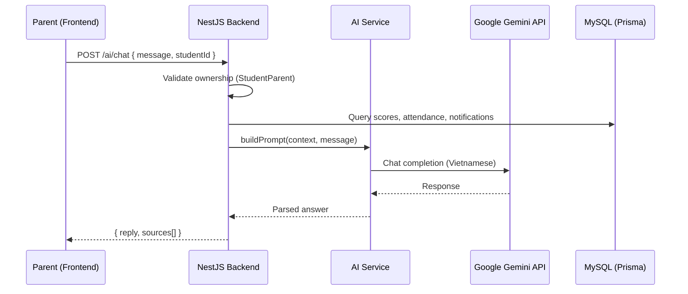
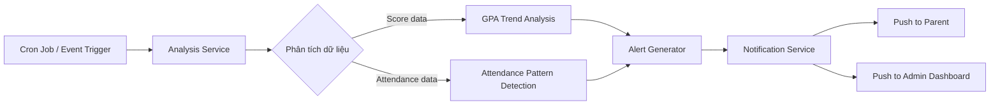
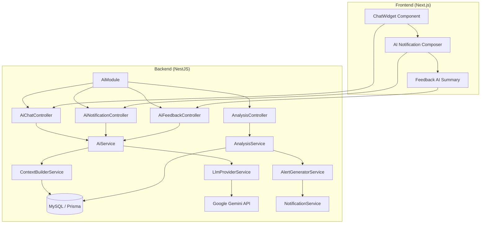
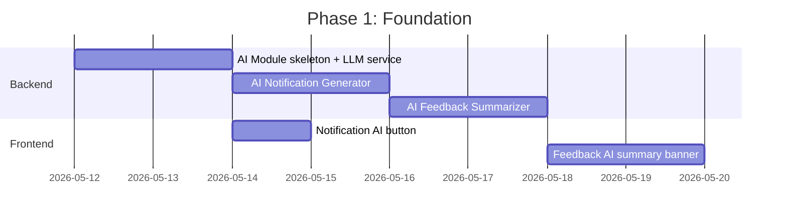

# 🤖 Phương án Tích hợp AI cho EduLink

## Tổng quan Dự án Hiện tại

Sau khi review toàn bộ codebase, EduLink là hệ thống quản lý giáo dục với:

| Thành phần | Chi tiết |
|---|---|
| **Roles** | Admin, Teacher, Parent |
| **Backend** | NestJS + Prisma + MySQL (18 models) |
| **Frontend** | Next.js 15 + Tailwind v4 + shadcn/ui |
| **Modules hiện có** | Score, Attendance, Feedback, Notification, Student, Parent, ClassSection, Dashboard |
| **Dữ liệu có sẵn** | Điểm số (assignment/midterm/final/avg), chuyên cần (present/late/absent), phản hồi phụ huynh, lớp học phần |

---

## 🏆 5 Tính năng AI Đề xuất (Xếp hạng theo Mức độ Phù hợp)

### Bảng So sánh Tổng quan

| # | Tính năng | Dành cho | Impact | Khả thi | Effort | Ưu tiên |
|---|---|---|---|---|---|---|
| 1 | **AI Chatbot Hỗ trợ Phụ huynh** | Parent | ⭐⭐⭐⭐⭐ | ⭐⭐⭐⭐⭐ | Trung bình | 🔴 Cao nhất |
| 2 | **Phân tích & Cảnh báo Học tập** | Admin, Parent | ⭐⭐⭐⭐⭐ | ⭐⭐⭐⭐ | Trung bình | 🔴 Cao |
| 3 | **Tóm tắt Phản hồi Thông minh** | Admin | ⭐⭐⭐⭐ | ⭐⭐⭐⭐⭐ | Thấp | 🟡 Trung bình |
| 4 | **Soạn thảo Thông báo AI** | Admin | ⭐⭐⭐⭐ | ⭐⭐⭐⭐⭐ | Thấp | 🟡 Trung bình |
| 5 | **Dự đoán Kết quả Học tập** | Admin, Teacher | ⭐⭐⭐⭐⭐ | ⭐⭐⭐ | Cao | 🟢 Dài hạn |

---

## 1. 🤖 AI Chatbot Hỗ trợ Phụ huynh (Ưu tiên #1)

> **Mức độ phù hợp: TUYỆT VỜI** — Tận dụng trực tiếp dữ liệu Score, Attendance, Notification hiện có

### Mô tả
Chatbot AI tích hợp vào giao diện Parent, cho phép phụ huynh hỏi bằng ngôn ngữ tự nhiên (tiếng Việt) về tình hình học tập của con. Chatbot tự động truy vấn dữ liệu từ hệ thống và trả lời chính xác.

### Ví dụ tương tác
```
👤 PH: "Con tôi học kỳ này điểm thế nào?"
🤖 AI: "Bé Nguyễn Văn A (MSSV: SV001) học kỳ HK1-2024 có:
        - Toán cao cấp: TB 8.5 ✅
        - Vật lý đại cương: TB 6.2 ⚠️ (dưới trung bình lớp 7.1)
        - Lập trình C: TB 9.0 🌟
        Điểm trung bình chung: 7.9 — Khá tốt!"

👤 PH: "Con tôi có nghỉ học nhiều không?"
🤖 AI: "Trong HK1-2024, bé đã vắng 3/45 buổi (6.7%).
        Tuy nhiên, có 2 buổi trễ. Tỉ lệ chuyên cần tổng: 93.3% — Đạt yêu cầu."

👤 PH: "So sánh với kỳ trước thì sao?"
🤖 AI: "So với HK2-2023:
        - GPA tăng từ 7.2 → 7.9 (+0.7) 📈
        - Chuyên cần cải thiện từ 88% → 93.3% 📈
        Nhìn chung bé đang có xu hướng tiến bộ rõ rệt!"
```

### Kiến trúc Kỹ thuật



### Backend Implementation

#### Cấu trúc Module mới
```
backend/src/modules/ai/
├── ai.module.ts
├── ai.controller.ts
├── ai.service.ts           ← Core logic: build context + call LLM
├── ai-context.builder.ts   ← Truy vấn DB, build prompt
└── dto/
    ├── chat.dto.ts
    └── chat-response.dto.ts
```

#### Schema bổ sung (Prisma)
```prisma
model ChatHistory {
  chat_id    Int      @id @default(autoincrement())
  parent_id  Int
  student_id Int?
  role       String   // 'user' | 'assistant'
  content    String   @db.Text
  created_at DateTime @default(now())

  @@index([parent_id, created_at])
}
```

#### API Endpoints
```
POST /ai/chat           — Parent gửi tin nhắn, nhận phản hồi AI
GET  /ai/chat/history   — Lấy lịch sử chat (phân trang)
DELETE /ai/chat/history  — Xóa lịch sử chat
```

### Tại sao phù hợp nhất?
1. **Dữ liệu sẵn có**: Score, Attendance, Notification đều đã có đầy đủ trong DB
2. **Giải quyết pain point thực**: Phụ huynh hiện phải tự navigate qua nhiều trang để xem điểm/chuyên cần
3. **Ownership check đã có**: `StudentParent` model đảm bảo data privacy
4. **Vietnamese NLP**: Gemini hỗ trợ tốt tiếng Việt, prompt engineering đơn giản

### Chi phí ước tính
- **Gemini 2.0 Flash**: ~$0.10/1M input tokens, ~$0.40/1M output tokens
- Trung bình 1 câu hỏi ≈ 2000 tokens → ~$0.001/câu hỏi
- **100 phụ huynh × 5 câu/ngày = $15/tháng**

---

## 2. 📊 Phân tích & Cảnh báo Học tập Tự động (Ưu tiên #2)

> **Mức độ phù hợp: RẤT CAO** — Tận dụng dữ liệu Score + Attendance có sẵn để tạo insight tự động

### Mô tả
Hệ thống tự động phân tích dữ liệu điểm số và chuyên cần, phát hiện xu hướng bất thường và gửi cảnh báo proactive cho Admin/Parent.

### Các loại cảnh báo

| Loại | Điều kiện | Gửi cho |
|---|---|---|
| 🔴 **GPA sụt giảm** | GPA giảm ≥ 1.0 so với kỳ trước | Admin + Parent |
| 🟡 **Vắng học nhiều** | Tỉ lệ vắng > 20% tổng buổi | Admin + Parent |
| 🔴 **Nguy cơ rớt môn** | Điểm assignment + midterm < 4.0 | Admin + Parent |
| 🟢 **Tiến bộ vượt bậc** | GPA tăng ≥ 1.5 so với kỳ trước | Parent (khích lệ) |
| 🟡 **Đi trễ liên tục** | ≥ 3 buổi trễ liên tiếp | Admin + Parent |

### Kiến trúc



### Backend Implementation

#### Module structure
```
backend/src/modules/ai/
├── analysis/
│   ├── analysis.service.ts        ← Phân tích xu hướng điểm/chuyên cần
│   ├── alert-generator.service.ts ← Tạo cảnh báo
│   └── analysis.cron.ts           ← Scheduled job (chạy hàng đêm)
```

#### Logic phân tích (không cần LLM — rule-based + thống kê)
```typescript
// Ví dụ: phát hiện GPA sụt giảm
async detectGpaDecline(studentId: number): Promise<Alert | null> {
  const scores = await this.prisma.score.findMany({
    where: { student_id: studentId, publish_status: 'PUBLISHED' },
    orderBy: { year: 'desc' },
  });

  const currentSemGpa = this.calculateGpa(scores, currentSemester);
  const prevSemGpa = this.calculateGpa(scores, prevSemester);

  if (prevSemGpa - currentSemGpa >= 1.0) {
    return {
      type: 'GPA_DECLINE',
      severity: 'HIGH',
      message: `GPA giảm từ ${prevSemGpa} → ${currentSemGpa}`,
      student_id: studentId,
    };
  }
  return null;
}
```

### Tại sao phù hợp?
1. **Không cần LLM đắt tiền** cho phần phát hiện (rule-based), chỉ cần LLM cho phần tạo nội dung cảnh báo tự nhiên
2. **Tận dụng Notification module** đã hoàn chỉnh, chỉ cần tạo notification mới
3. **Tạo giá trị proactive**: thay vì phụ huynh phải tự kiểm tra, hệ thống chủ động thông báo

---

## 3. 📝 Tóm tắt Phản hồi Thông minh cho Admin (Ưu tiên #3)

> **Mức độ phù hợp: CAO** — Module Feedback đã hoàn chỉnh với thread messages

### Mô tả
AI tóm tắt các phản hồi đang OPEN/IN_PROGRESS, phân loại mức độ ưu tiên, gợi ý nội dung trả lời cho Admin.

### Tính năng cụ thể

| Tính năng | Mô tả |
|---|---|
| **Tóm tắt daily** | "Hôm nay có 5 phản hồi mới: 2 về học tập, 2 về tài chính, 1 về kỷ luật" |
| **Phân loại ưu tiên** | AI đánh giá sentiment & urgency → sắp xếp lại danh sách |
| **Gợi ý trả lời** | Admin click "Gợi ý AI" → Nhận draft reply dựa trên context |
| **Phát hiện duplicate** | Gom nhóm các phản hồi cùng chủ đề |

### Tích hợp vào giao diện Admin hiện tại

```
Trang Admin Feedbacks → Thêm:
├── 🆕 Banner "AI Summary" ở đầu trang
│   └── "5 phản hồi cần xử lý gấp, 3 về học tập có nội dung tương tự"
├── 🆕 Badge ưu tiên AI trên mỗi feedback card
│   └── 🔴 Khẩn cấp | 🟡 Cần xem | 🟢 Thông thường
└── 🆕 Nút "✨ Gợi ý trả lời" trong thread
    └── AI draft reply dựa trên nội dung + category
```

### API Endpoints
```
GET  /ai/feedback/summary          — Tóm tắt feedbacks hiện tại
POST /ai/feedback/:id/suggest-reply — Gợi ý nội dung reply
POST /ai/feedback/prioritize       — Phân loại ưu tiên batch
```

### Tại sao phù hợp?
1. **Effort thấp**: Chỉ cần thêm 2-3 endpoint + 1 component UI
2. **Feedback model đã đầy đủ**: Có category, status, messages thread
3. **Tiết kiệm thời gian Admin**: Giảm thời gian đọc/phân loại feedback hàng ngày

---

## 4. ✍️ Soạn thảo Thông báo AI cho Admin (Ưu tiên #4)

> **Mức độ phù hợp: CAO** — Module Notification đã có, chỉ cần thêm AI generation

### Mô tả
Admin nhập ý chính → AI tạo thông báo hoàn chỉnh, chuyên nghiệp, đúng ngữ cảnh giáo dục.

### Luồng sử dụng

```
Admin → Trang "Tạo thông báo" → Thêm ô input:
  ┌─────────────────────────────────────────┐
  │ 💡 Mô tả ngắn ý chính:                 │
  │ ┌─────────────────────────────────────┐ │
  │ │ "Thông báo lịch thi cuối kỳ HK1    │ │
  │ │  bắt đầu từ 15/6, xem phòng thi    │ │
  │ │  trên portal"                       │ │
  │ └─────────────────────────────────────┘ │
  │ [✨ Tạo với AI]                         │
  └─────────────────────────────────────────┘
           ↓
  Title:   "Thông báo Lịch thi Cuối kỳ HK1 năm học 2024-2025"
  Content: "Kính gửi Quý phụ huynh và sinh viên,
            Nhà trường xin thông báo lịch thi cuối kỳ..."
           ↓
  Admin review → Chỉnh sửa nếu cần → Gửi
```

### API Endpoints
```
POST /ai/notification/generate  — Tạo draft thông báo từ ý chính
```

### Tại sao phù hợp?
1. **Cực kỳ đơn giản**: 1 endpoint backend + 1 nút trên form tạo thông báo
2. **Notification module đã sẵn**: Chỉ generate content rồi điền vào form
3. **Giá trị thực tế cao**: Admin tiết kiệm 5-10 phút mỗi thông báo

---

## 5. 🔮 Dự đoán Kết quả Học tập (Ưu tiên #5 — Dài hạn)

> **Mức độ phù hợp: TRUNG BÌNH-CAO** — Cần đủ dữ liệu lịch sử, phù hợp khi hệ thống chạy 1+ năm

### Mô tả
Dựa trên dữ liệu điểm số và chuyên cần qua nhiều kỳ, AI dự đoán xác suất đạt/rớt của sinh viên cho kỳ tới.

### Model dự đoán
```
Input features:
  - GPA các kỳ trước (Score.avg)
  - Tỉ lệ chuyên cần (Attendance.absent_sessions / total_sessions)
  - Xu hướng điểm (tăng/giảm)
  - Số lần trễ (Attendance.late_sessions)

Output:
  - risk_level: LOW | MEDIUM | HIGH
  - predicted_gpa_range: [min, max]
  - factors: ["Chuyên cần thấp", "GPA giảm 2 kỳ liên tiếp"]
```

### Tại sao để sau?
- Cần dữ liệu lịch sử đủ nhiều (≥ 2 kỳ)
- Cần train/fine-tune model hoặc dùng structured prompt phức tạp hơn
- Có thể bắt đầu với rule-based rồi nâng cấp lên ML sau

---

## 🏗️ Kiến trúc Tổng thể AI Module



### Tech Stack AI

| Component | Lựa chọn | Lý do |
|---|---|---|
| **LLM Provider** | Google Gemini 2.0 Flash | Chi phí thấp, hỗ trợ tiếng Việt tốt, API stable |
| **SDK** | `@google/generative-ai` | Official SDK cho Node.js |
| **Caching** | In-memory (NestJS CacheModule) | Cache kết quả phân tích, giảm API calls |
| **Rate Limiting** | Throttler đã có | Mở rộng config cho AI endpoints |
| **Monitoring** | Token usage logging | Track cost per user/per feature |

---

## 📋 Kế hoạch Triển khai Theo Giai đoạn

### Phase 1: Foundation + Quick Wins (1-2 tuần)



**Deliverables:**
- [x] `AiModule` skeleton với `LlmProviderService` (Gemini integration)
- [x] `POST /ai/notification/generate` — Soạn thông báo AI
- [x] `GET /ai/feedback/summary` — Tóm tắt feedback
- [x] `POST /ai/feedback/:id/suggest-reply` — Gợi ý trả lời
- [x] Frontend: Nút "✨ Tạo với AI" trên form thông báo
- [x] Frontend: AI Summary banner trên trang feedbacks

### Phase 2: AI Chatbot (2-3 tuần)

**Deliverables:**
- [ ] `ChatHistory` model + migration
- [ ] `POST /ai/chat` — Chat endpoint với context building
- [ ] `GET /ai/chat/history` — Lịch sử chat
- [ ] Frontend: ChatWidget component (floating button)
- [ ] Frontend: Chat page cho Parent dashboard
- [ ] Prompt engineering cho Vietnamese education context

### Phase 3: Smart Alerts (1-2 tuần)

**Deliverables:**
- [ ] `AnalysisService` — Rule-based alert detection
- [ ] Cron job chạy hàng đêm (NestJS `@Cron`)
- [ ] Tích hợp vào Notification module
- [ ] Frontend: Alert indicators trên Parent dashboard
- [ ] Admin: Alert overview panel

### Phase 4: Prediction (Tùy chọn — Dài hạn)
- [ ] Data collection pipeline
- [ ] Prediction model (Gemini structured output)
- [ ] Risk dashboard cho Admin/Teacher

---

## 🔧 Bước Tiếp Theo Ngay Lập Tức

Để bắt đầu, tôi đề xuất triển khai **Phase 1** trước — vì:

1. **Effort thấp nhất** (3-4 ngày code)
2. **Thấy kết quả ngay** trên UI hiện tại
3. **Thiết lập foundation** (AI Module, LLM Service) cho các phase sau
4. **Không cần thay đổi DB schema** (chưa cần ChatHistory)

> [!IMPORTANT]
> **Cần quyết định trước khi bắt đầu:**
> 1. Bạn muốn dùng **Google Gemini** hay **OpenAI GPT**? (Gemini rẻ hơn, GPT mạnh hơn)
> 2. Bạn có **API key** sẵn chưa?
> 3. Bạn muốn bắt đầu từ tính năng nào trước?

---

## 💰 Chi phí Ước tính Tổng

| Tính năng | Tokens/lần | Lần/ngày (100 users) | Chi phí/tháng |
|---|---|---|---|
| Chatbot | ~2000 | 500 | ~$15 |
| Notification Generator | ~1500 | 10 | ~$0.50 |
| Feedback Summary | ~3000 | 20 | ~$2 |
| Feedback Reply Suggest | ~1500 | 30 | ~$1.50 |
| **Tổng** | | | **~$19/tháng** |

> [!TIP]
> Với Gemini 2.0 Flash, tổng chi phí AI chỉ khoảng **$15-25/tháng** cho ~100 active users. Rất kinh tế cho một hệ thống giáo dục.
